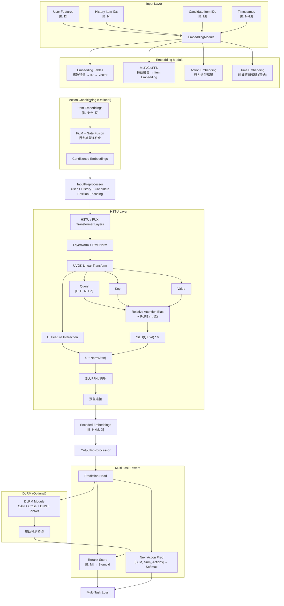
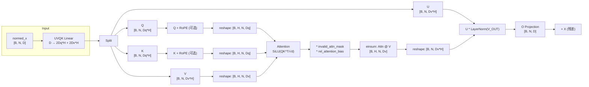
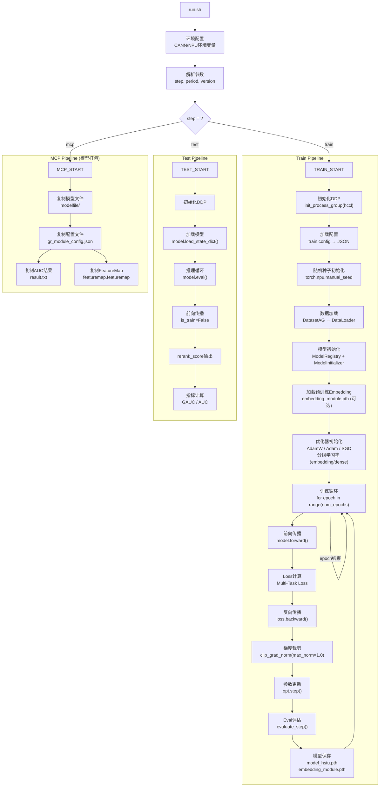

# Game MTGR Ranking Model

## 1. 项目概述 (Project Overview)

本项目是美团MTGR (Meituan Generative Recommendation)精排模型在**游戏业务场景**下的训练与推理实现。项目基于华为NPU平台进行分布式训练，支持多任务学习、图结构特征融合与高精度推理。

### 核心特性

| 特性 | 描述 |
|------|------|
| **多任务学习** | 支持多任务Tower结构 (MMoE/PLE)，可同时预测点击、下载、付费等多类目标 |
| **序列建模** | 基于HSTU/FUXI Transformer架构，支持长时间用户行为序列建模 |
| **图结构融合** | 支持SID (App Hierarchy) 编码、行为类型条件化 (Action Conditioning) |
| **分布式训练** | 基于PyTorch DDP + HCCL (华为集合通信库) 的多卡多节点训练 |
| **混合精度** | 支持FP16/BF16混合精度训练，配合NPU加速 |
| **插件化架构** | 模块化设计，通过配置灵活切换GNN变体、损失函数、特征编码方式 |

---

## 2. 架构设计与模块解耦 (Architecture & Modularity)

### 2.1 目录结构

```
game_rpk_mtgr_v1/
├── run.sh                          # 执行入口脚本 (torchrun驱动)
├── main.py                         # 训练/推理主入口 (absl Flags解析)
├── train.config                    # 训练配置文件 (JSON格式)
├── const_global.py                 # 全局常量定义
├── modeling/                       # 模型定义核心目录
│   ├── model_registry.py           # 模型组件注册中心 (装饰器模式)
│   ├── model_initializer.py        # 模型初始化器
│   └── generic/sequential/         # 序列推荐模型实现
│       ├── base_model.py           # 基类模型 (模块初始化框架)
│       ├── GR_model.py             # 生成式推荐基模型
│       ├── multi_seq_mtgr_model.py # 多序列MTGR模型 (游戏业务主模型)
│       ├── act_cond_mtgr.py        # 行为条件化MTGR模型
│       ├── embedding_modules.py    # Embedding层 (含SideInfo融合)
│       ├── input_features_preprocessors.py  # 输入特征预处理
│       ├── transformers.py         # HSTU/FUXI Transformer实现
│       ├── prediction_modules.py   # 预测头模块 (Rerank/Action预测)
│       ├── loss_modules.py         # 损失函数模块 (BCE/CE/SampledSoftmax)
│       ├── output_postprocessors.py# 输出后处理
│       ├── attn_mask_modules.py    # 注意力掩码生成
│       ├── action_conditioning.py  # 行为条件化模块 (FiLM/Gate/AttnBias)
│       ├── dlrm.py                 # DLRM特征交叉模块
│       ├── dlrm_modules.py         # DLRM子模块 (CrossNetwork/PPNet)
│       ├── srn_module.py           # SRN兴趣增强模块
│       └── features.py             # 序列特征定义
├── data/                           # 数据处理核心目录
│   ├── reco_dataset.py             # 数据集工厂函数
│   ├── concat_dataset_v1.py        # 数据集实现 (DatasetAG/DatasetMusicLonger)
│   ├── data_loader.py              # DataLoader工厂
│   └── eval.py                     # 评估指标计算 (GAUC等)
└── utils/                          # 工具函数
    ├── common_utils.py             # 配置解析
    ├── model_saver.py              # 模型保存
    └── format_conversion.py        # 格式转换
```

### 2.2 模块化解耦设计

项目采用**配置驱动**的模块化设计，核心模块通过`ModelRegistry`注册机制实现解耦：

```
配置文件 (JSON)
    ↓
ModelInitializer → ModelRegistry.get_module_cls_dict()
    ↓
子模块实例化 (通过init_sub_model动态创建)
    ↓
组装成完整模型 (GR_model / MultiSeqMTGRModel / ActCondMTGRModel)
```

| 模块接口 | 核心职责 | 可插拔实现 |
|----------|----------|------------|
| `EmbeddingModule` | 特征ID → 向量 | `LocalEmbeddingModuleWithSideInfo` |
| `SequentialModule` | 序列建模 | `HSTU`, `FUXI` |
| `InputFeaturesPreprocessorModule` | 特征预处理 | `UserItemRatingInputFeaturePreprocessor`, `UserItemInputFeaturePreprocessor` |
| `AttentionMaskModule` | 注意力掩码 | 多种实现 |
| `LossModule` | 多任务Loss聚合 | `BinaryCrossEntropyLossForRerankScore`, `CrossEntropyLossForNextActionPred` |
| `FeedForwardModule` | 预测头 | `FeedForwardModuleForRerankScore`, `LinearModuleForRerankScore` |

---

## 3. 核心 Pipeline 详解

### 3.1 数据读取与处理 (Data Pipeline)

```
原始数据 (ORC/Parquet)
    ↓
DatasetAG / DatasetMusicLonger (IterableDataset)
    ├── 历史序列特征 (history_item_feature_columns)
    ├── 候选序列特征 (candidate_item_feature_columns)
    ├── 用户特征 (user_feature_columns)
    └── 时间戳/评分列
    ↓
MultiFileIterator (多文件迭代器, 支持分布式rank切分)
    ↓
DataLoader (prefetch_factor=128, num_workers多进程)
    ↓
SequentialFeatures (特征容器)
    ↓
模型输入 Dict[str, Tensor]
```

**关键设计**：
- `DatasetAG`: 支持游戏业务数据集，包含历史行为类型 (action_type) 和候选行为类型
- `token_per_item`: 控制序列中每个Item的Token数 (fuse_ia模式下单Item单Token)
- **分布式数据切分**: 通过`rank` % `world_size`实现数据分片

### 3.2 模型训练 (Training)

**分布式训练架构**：
```python
# main.py - torchrun启动多进程
torchrun --nproc_per_node=${NGPUS_PER_NODE} \
         --nnodes=${NNODES} \
         --node_rank=${NODE_RANK} \
         --master_addr=${MASTER_ADDR} \
         --master_port=${MASTER_PORT} \
         main.py --config_file=... --is_train=True
```

**核心训练循环** (`local_trainer.py:assemble_ag_model_executable_callback`)：
```python
for batch in dataloader:
    # 1. Host to Device异步数据迁移
    model_input = {k: v.to(device) for k, v in batch.items()}
    
    # 2. 前向传播
    output = model(model_input, is_train=True)
    
    # 3. 梯度清零
    opt.zero_grad()
    
    # 4. 反向传播
    output.backward()
    
    # 5. 梯度裁剪
    torch.nn.utils.clip_grad_norm_(model.parameters(), max_grad_norm=1.0)
    
    # 6. 参数更新
    opt.step()
```

**多任务Loss设计** (`loss_modules.py:LossModule`)：
```python
# 多个子Loss并行计算
losses = [
    BinaryCrossEntropyLossForRerankScore(),   # 重排分数BCE Loss
    CrossEntropyLossForNextActionPred(),       # 下一行为类型CE Loss
    SampledSoftmaxLossForNextItemPred()        # Sampled Softmax Loss
]
# 聚合
total_loss = SumLossAggregator(losses)
```

### 3.3 模型推理 (Inference)

**推理流程**：
```python
# 1. 加载模型权重 (phase="train")
model.load_state_dict(torch.load("model_hstu.pth"))

# 2. 切换eval模式
model.eval()
torch.no_grad()

# 3. Batch推理
for batch in eval_dataloader:
    output = model(batch, is_train=False)  # 跳过Loss计算
    rerank_scores = output["rerank_score"]  # [B, num_rerank]
```

**模型导出支持**：
- PyTorch StateDict 保存
- TorchScript 导出 (`torch.onnx.is_in_onnx_export()`)

---

## 4. MTGR 模型结构剖析 (Model Architecture)

### 4.1 整体网络结构



### 4.2 HSTU Attention机制详解



---

## 5. 端到端训练与推理流程 (End-to-End Workflow)



---

## 6. 核心组件与可选模块 (Core & Optional Components)

### 6.1 核心组件

| 组件 | 文件 | 描述 |
|------|------|------|
| **HSTU Transformer** | `transformers.py:HSTU` | 高效序列建模Attention，支持Relative Attention Bias + RoPE |
| **EmbeddingModule** | `embedding_modules.py:LocalEmbeddingModuleWithSideInfo` | 支持SideInfo融合、Time Fixed Token |
| **DLRM** | `dlrm.py:DLRM` | 特征交叉模块 (CAN/Cross/DNN/PPNet) |
| **Action Conditioning** | `action_conditioning.py` | FiLM + Gate + Attention Bias行为条件化 |
| **LossModule** | `loss_modules.py:LossModule` | 多任务Loss聚合 (BCE + CE + SampledSoftmax) |
| **NegativeSampler** | `negative_sampler.py` | 负采样器 (Sampled Softmax Loss) |

### 6.2 可插拔模块 (Plug-and-Play)

通过配置文件切换：

```json
{
  "model_cfg": {
    "sub_models": {
      "SequentialModule": {
        "module_name": "HSTU"  // 可切换为 "FUXI"
      },
      "FeedForwardModule": {
        "sub_models": {
          "FeedForwardModuleForRerankScore": {
            "module_name": "LinearModuleForRerankScore"  // 简化为Linear
          }
        }
      }
    }
  },
  "model_conf": {
    "use_dlrm": true,          // 启用DLRM特征交叉
    "use_hstu": true,          // 启用HSTU (否则用基础Transformer)
    "use_sid": false,          // 启用SID编码
    "use_action_conditioning": false,  // 启用行为条件化
    "use_enhanced_interest_embeddings": false,  // 启用SRN
    "history_embedding_mode": "per_action"  // 或 "unified"
  }
}
```

| 配置项 | 可选值 | 说明 |
|--------|--------|------|
| `SequentialModule` | `HSTU`, `FUXI` | 序列建模架构 |
| `FeedForwardModuleForRerankScore` | `FeedForwardModuleForRerankScore`, `LinearModuleForRerankScore` | 预测头复杂度 |
| `loss_aggregator` | `SumLossAggregator` | Loss聚合方式 |
| `normalization` | `rel_bias`, `att_free_bias` | Attention Normalization方式 |
| `ffn_type` | `ffn`, `glu_ffn` | FFN层类型 |
| `pos_encoding_type` | `rope`, `fixed` | 位置编码类型 |

---

## 7. 快速开始 (Quick Start)

### 7.1 配置文件说明

训练配置通过`train.config` (JSON格式) 管理：

```json
{
  "gr_module_config": {
    "common_hp": {
      "train_conf": {
        "learning_rate": 0.001,
        "weight_decay": 0.01,
        "beta": [0.9, 0.999],
        "optimizer_type": "adamw",
        "local_batch_size": 512,
        "num_epochs": 10,
        "max_grad_norm": 1.0,
        "phase": "train"
      },
      "model_conf": {
        "item_embedding_dim": 256,
        "max_sequence_length": 400,
        "use_hstu": true,
        "use_dlrm": false
      },
      "data_loader_conf": {
        "dataset_name": "Game",
        "history_length": 400,
        "num_rerank": 256,
        "train_data_path": "train/",
        "valid_data_path": "valid/"
      },
      "export_conf": {
        "save_dir_name": "modelfile"
      }
    }
  }
}
```

### 7.2 训练命令

```bash
# 通过run.sh执行训练
bash run.sh \
    step=train \
    period=20251018-000000 \
    version=v1 \
    data_dir=/path/to/data/ \
    output_dir=/path/to/output/ \
    train_config_file=./train.config \
    llm_embedding_path=llm_embedding \
    mxrec_acceleration_ops=/path/to/mxrec_ops
```

### 7.3 推理命令

```bash
# 通过run.sh执行推理
bash run.sh \
    step=test \
    period=20251018-000000 \
    version=v1 \
    data_dir=/path/to/data/ \
    output_dir=/path/to/output/ \
    train_config_file=./train.config \
    llm_embedding_path=llm_embedding
```

### 7.4 关键超参说明

| 超参 | 默认值 | 说明 |
|------|--------|------|
| `item_embedding_dim` | 256 | Item embedding维度 |
| `max_sequence_length` | 400 | 历史序列最大长度 |
| `num_rerank` | 256 | 候选集大小 |
| `learning_rate` | 1e-3 | 学习率 |
| `local_batch_size` | 512 | 单卡batch size |
| `max_grad_norm` | 1.0 | 梯度裁剪阈值 |
| `phase` | `pretrain` | 阶段: `pretrain` (Embedding预训练) / `train` (下游精排) |

---

## 附录: 模型尺寸统计

```python
# main.py:_model_size_in_gib()
Model total parameters:   {total_params:.2f}M
Model emb. parameters:    {emb_params:.2f}M
Model dlrm parameters:    {dlrm_params:.2f}M
Model rankmixer params:   {rankmixer_params:.2f}M
Model transformer params: {transformer_params:.2f}M
Model other(inp&ffn):     {other_params:.2f}M
Model total dense params: {total_dense_params:.2f}M
```
